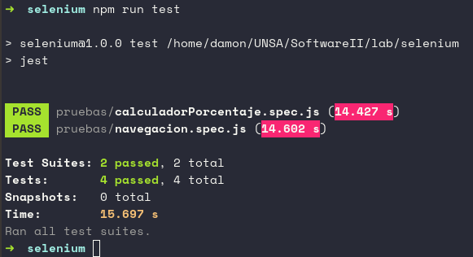

# Jest + Selenium WebDriver

## Diseño de casos de prueba

| Accion                   | Pasos                       | Entrada |   Valor esperado   |
|--------------------------|-----------------------------|---------|--------------------|
|                          | Ingresar al sitio           |         |                    |
| Calcular porcentaje      | Ingresar porcentaje valido  |   50    |                    |
|                          | Ingresar un numero valido   |   18    |                    |
|                          | Click sobre calcular        |         |        9           |
|                          |                             |         |                    |
|                          | Ingresar al sitio           |         |                    |
| Ingresar un dato erroneo | Ingresar un numero valido   |    5    | 'Please provide    |
|                          | Ingresar un numero invalido |    a    | two numeric values |
|                          | Click sobre calcular        |         |   in any field'    |


## Instalacion

Para la automatizacion usaremos [Node.js](https://nodejs.org/es/) y el gestor de paquetes de este [npm](https://docs.npmjs.com/downloading-and-installing-node-js-and-npm).

```bash
$ sudo pacman -S nodejs npm
```

# Automatización de pruebas funcionales

- Creamos un directorio para nuestras pruebas.

- Creamos el archivo package.json corriendo el siguiente comando.

```bash
$ npm init -y
```

- Luego, instalamos localmente en nuestro proyecto lo siguiente.

    - chromedriver
    - geckodriver
    - selenium-webdriver
    - Jest


```bash
$ npm install --save-dev chromedriver
$ npm install --save-dev geckodriver
$ npm install --save-dev selenium-webdriver
$ npm install --save-dev jest
```

- Configuramos nuestro archivo package.json, es importante que la seccion de scripts este jest.

- Creamos nuestro archivo de configuración, en este caso llamado *selenium.config.js* y configuramos de la siguiente manera.

```javascript
module.exports = {
    testPathIgnorePatterns: ['<rootDir>/node_modules/'],
    testRegex: '(/test/.*|(\\.|/)(test|spec))\\.jsx?$',
    bail: false,
    verbose: true
};
```

- Creamos los scripts de nuestras pruebas a realizar para lo que crearemos la carpeta *pruebas* en la cual iran los archivos de extencion *.spec.js*  

- Finalmente, ejecutamos las pruebas creadas.

```bash
$ npm run test
```

<p align="center"></p>

<p align="center"></p>

